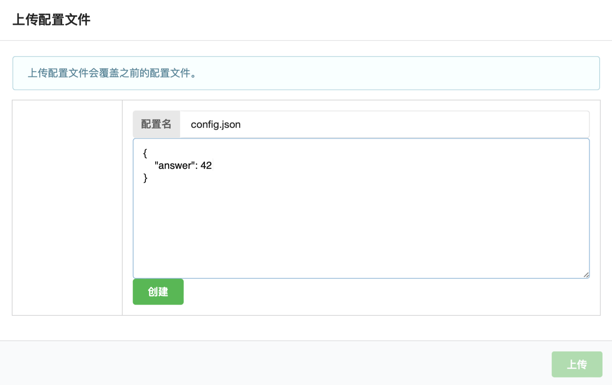
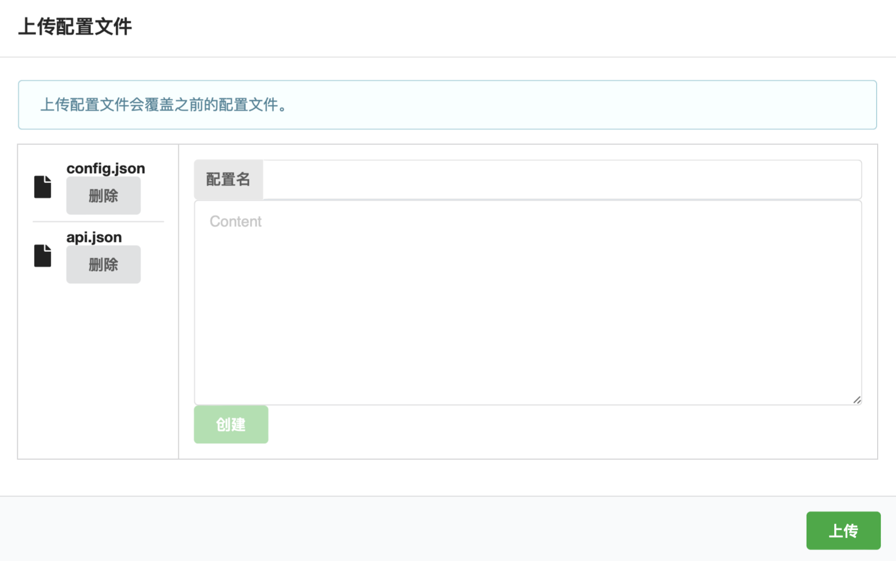
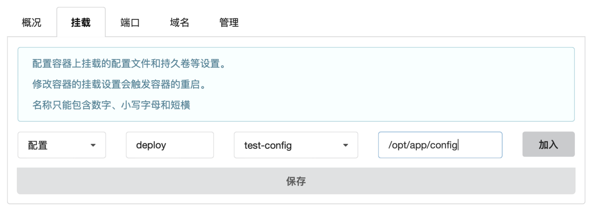
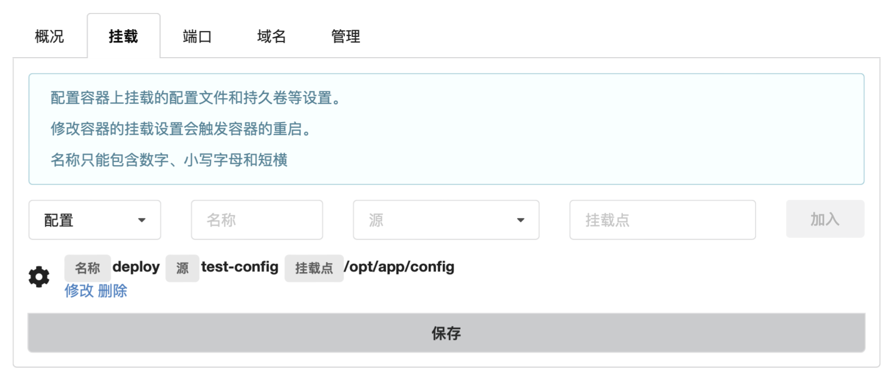

# SECoder

SECoder 提供了可视化的界面来进行[项目管理](https://sep.secoder.net/#/manage/general)。

## 项目管理

在这里可以查看项目的各项统计数据，包括团队成员的提交数量和质量、任务数量、各仓库的代码行数、注释比例、构建成功率、测试覆盖率等。

## 仓库管理

在这里可以管理团队的仓库。创建仓库时，若选择“启用部署”，将会同时创建与仓库绑定的容器，容器默认镜像为 `nginx`。在每个仓库下方的四个按钮分别为在 GitLab 中查看、在 SonarQube 中查看、打开项目的部署网址以及删除仓库。

## 部署管理

### 部署密钥

这是你所在的团队环境的部署密钥。如果需要在本地使用 deployer 工具，你可以利用这个密钥来获得对环境的访问权限。

!!! warning "妥善保管密钥"

    请不要将密钥泄露给其他人，否则其将拥有对环境的完全权限，包括但不限于删除你的数据库持久存储等。

### 容器

在这里可以管理环境中的容器。立方体的颜色表明容器的状态：

|颜色|状态|
|-|-|
|
紫色
|运行中|
|
绿色
|更新中|
|
红色
|错误|
|
灰色
|暂停|
|
黑色
|崩溃|

点击容器可以进入容器的管理页面。

#### 概况

在这里查看容器的信息汇总。你可以通过“镜像”来替换容器的镜像。

!!! failure "外部服务功能暂时不可用"

    目前 SECoder 平台的外部服务功能处于不可用状态，这一功能原本被设计用于将其他端口的请求转发到 80 端口。

#### 挂载

可以在这里管理容器的挂载项，包括配置项和持久存储。

!!! warning "容器重启"

    保存挂载项设置会导致容器重启。

#### 端口

可以在这里管理容器对外暴露的端口。所有容器都会暴露 80 端口，你可以在这里增加其他暴露的端口。

!!! note "Dockerfile 中也需要暴露端口"

    你需要在 Dockerfile 中也声明暴露同样的端口才能够使设置生效。

!!! warning "容器重启"

    保存端口设置会导致容器重启。

!!! warning "外部访问限制"

    由于 SECoder 平台的限制，只有 80 端口能够通过外部网络访问，其余暴露的端口只能通过内网域名进行访问，即只能在部署在 SECoder 上的容器之间进行通信，无法从外部访问。

#### 域名

可以在这里管理容器的域名。所有容器都有两个默认域名：`<dyno>-<env>.app.secoder.net` 和 `<dyno>.<env>.secoder.local`，其中 `dyno` 为容器名，`env` 为环境名。前者可以通过外部访问，对它的请求将会被转发到容器的 80 端口；后者只能够在 SECoder 内部访问。除 80 外的其他端口只能通过内部域名进行访问。

!!! failure "自定义域名功能暂时不可用"

    目前 SECoder 平台的自定义域名功能处于不可用状态。

#### 管理

可以在这里管理容器运行状态。

日志功能可以查看容器的标准输出与标准错误输出。你可以将日志文件 (例如 nginx 在 `/var/log/nginx` 目录下的 `access.log` 与 `error.log`) 符号链接到标准输出或标准错误输出来在日志中展示它们。

管理页面会显示所有容器实例。一般情况下，这里只会有一个容器实例，因为 SECoder 会移除已经停止运行的容器实例。然而，在某些情况下，这里可能会有多个实例，这说明新的容器实例启动失败了。容器实例的颜色表明容器实例的状态：

|颜色|状态|
|-|-|
|
绿色
|运行中|
|
黄色
|错误|

可以打开运行中容器实例的终端，这时将会运行 `/bin/bash`，你可以在其中执行命令。

!!! failure "监控数据功能暂时不可用"

    目前 SECoder 平台的监控数据功能与 Grafana 系统处于不可用状态。

#### 新建容器

可以在管理界面新建不与仓库绑定的容器。你可以指定所需的镜像并可选地提供 image registry 的用户名与密码。这可能被用于数据库容器等。

### 配置

在开发时和正式部署时使用不同的配置是一种常见做法。例如，你可以让你的后端在开发时连接本地的数据库，在部署时连接部署的数据库。然而，由于容器的易失性，一个容器在重新启动后其中所做的修改都将丢失。这意味着如果我们每次都进入容器手动修改配置将十分低效。

我们可以通过配置项来简化这个流程。配置项是只读的挂载项，可以用于存放各种配置文件。配置项可以作为一个目录被挂载到容器中。这样，在部署时将会自动使用挂载的配置。

可以在这里管理配置项。你可以对配置项进行新建、上传、预览、重命名和删除操作。

!!! warning "上传不是增量的"

    上传配置时，将会用新的配置项完全覆盖旧的配置项。这意味着如果原来的配置项中的某一文件没有在上传时提供，该文件将会丢失。因此，请注意在更新配置前先下载原来的配置，并将不作修改的配置文件重新原样上传。

??? example "配置挂载演示"

    我们将演示如何通过 SECoder 平台进行配置项的挂载。

    1. 点击“新建配置”按钮

        

    2. 输入配置项名称，点击“创建”

        

    3. 找到新建的配置项，点击“上传”

        

    4. 添加配置文件，点击“创建”

        

    5. 逐个添加配置文件，完成后点击“上传”

        

    6. 进入容器管理界面的“挂载”选项卡

        

    7. 选择“配置”，“名称”可自行取便于识别的描述性名称，“源”选择添加的配置项，“挂载点”填写项目中配置文件所在的目录，点击“加入”

        

    8. 点击“保存”，注意保存会导致容器重启

        

    9. 挂载已完成，进入“管理”选项卡打开终端

        

    10. 查看挂载的目录下的文件，发现挂载成功

        

### 持久存储

数据库容器等需要在容器内保存数据。但同样由于容器的易失性，在容器重启时其中的数据将会丢失，因此我们需要一种能够持久保存数据的方法。

持久存储与配置项类似，都可以挂载到容器的某一目录。它们之间的不同点在于持久存储是可写的，并且你不需要为其提供初始内容。这样，我们就可以在容器重新启动时不致丢失数据了。

可以在这里管理持久存储。你可以对持久存储进行新建、重命名和删除操作。

!!! note "可参考配置项挂载"

    持久存储的挂载步骤与配置项类似，可以参考上方的演示进行持久存储的挂载。

## 参考资料

你可以阅读 [SECoder 用户手册](https://docs.secoder.net)来获取关于 SECoder 的其他帮助。