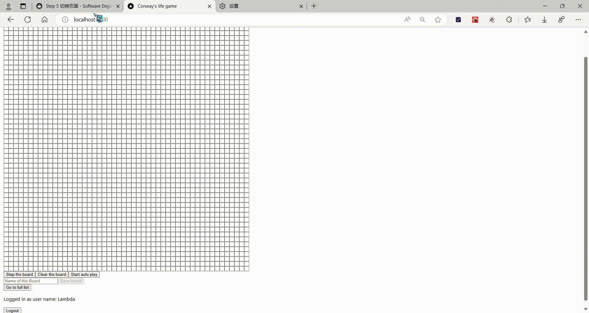

# 切换页面

## 实验目的

通过本 Step，我们希望你能够掌握如何在 Next.js 框架中设置页面路由和跳转，从而基本完成游戏记录列表页面。

## 实验步骤

首先你需要理解 Next.js 框架中如何管理页面路由，以及简单了解如何使用 `useRouter` Hook 来获取路由相关的基本信息以及实现页面跳转。

本 Step 需要你完成的是游戏记录列表页面，路径为 `/list`。我们已经在游戏主界面（路径为 `/`）底部写好了一个点击后能跳转到该页面的按钮，按钮上文字应当是 Go to full list。

之后，你需要在文件 `src/pages/list.tsx` 中的 `ListScreen` 组件内完成一处代码填空，完成游戏记录列表页面的 UI，填空的代码量在 20 行以内。在完成填空后，游戏记录列表页面应当具有下述的交互：

- 页面加载完成后显示游戏记录的列表，若暂无游戏记录，则显示空列表提示文字
- 点击某个记录的 Play it 按钮可以跳转到 Replay Mode 的游戏主界面回放该记录（Replay Mode 的主界面已经为你实现好了，路径为 `/?id={id}`）
- 点击自己所创建的记录的 Delete it 按钮可以删除该记录（非自己的记录则不显示该按钮），需要有弹窗提示删除成功，删除成功后列表中该记录应当立刻消失
    - 该交互由于处理删除记录的函数 `deleteBoard` 在下一个 Step 才需要填充，故仅要求将按钮展示出来即可
- 点击某个记录的 View this user 按钮可以跳转到该记录作者的所有游戏记录页面（路径为 `/list?name={userName}`）

具体的 UI 结构设计可以参考需求文档中的截图。

完成本 Step 后，你的游戏记录列表的交互应当和下述 GIF 图所展示的类似：

### 实验提示

在渲染一个列表的时候不妨考虑一下 `Array.map` 方法，其会接受一个回调函数并且将数组中每一项按照回调函数指明的规则映射为新数组中对应项。回忆一下，React 组件的渲染，不就是将数据映射为 UI 吗？

### 代码说明

我们已经在 `ListScreen` 组件内声明了 `refreshing, boardList` 两个组件状态，可以直接在此基础上完成你的代码。前者用于表示当前页面是否还在获取数据过程中，后者则用于存储列表页面用于展示的游戏记录。

此外，你可以注意到我们在解析路由中用户名参数的时候使用了 `decodeURIComponent` 函数，这是因为用户名中可能含有部分特殊字符，如 `?/!#@` 或者空格，这些字符无法直接嵌入链接中。

## 知识讲解

由于本 Step 所涉及的技术要点基本都有成熟的文档介绍，这里直接引用参考文档链接。

你需要了解 Next.js 是通过 `pages` 目录下的目录结构管理路由的，具体的文档参见 [Next.js 官方文档相关页面](https://nextjs.org/docs/routing/introduction)。

关于路由，Next.js 定义了 `useRouter` Hook。其可以用于获取动态路由之中携带的参数以及通过 `const router = useRouter(); router.push(...);` 的方式实现页面跳转。该 Hook 的文档见 [官方指导](https://nextjs.org/docs/api-reference/next/router#userouter)。

!!! note "浏览器 JavaScript 与 `useRouter`"

    我们提到过使用 `router.push()` 方法可以令页面跳转，然而在浏览器原生 JavaScript 中，对 `window.location.href` 赋值也能实现页面跳转。

    这两者的核心区别在于使用原生 JavaScript 会导致整个页面的完全重加载，这对性能而言是相当不利的。所以，我们推荐使用 `useRouter` 的方式实现页面跳转，非必要不使用原生 JavaScript 方法。