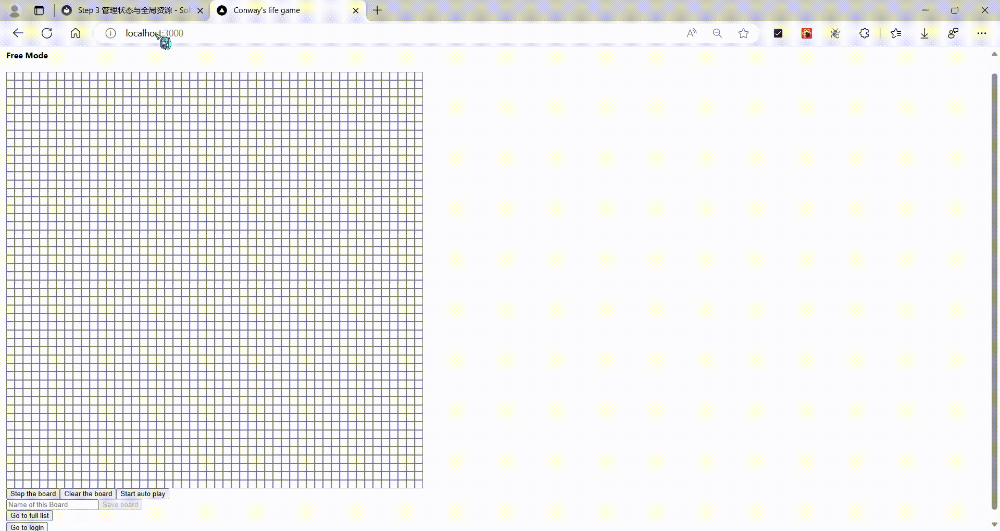

# 管理状态与处理事件

## 实验目的

通过本 Step，我们希望你能够掌握如何设定一个有状态的 React 组件以及如何通过回调函数处理各种事件，最终能够编写出一个能够通过点击棋盘切换细胞状态以及能够通过点击按钮推进演变的康威生命游戏。

## 实验步骤

首先，你需要理解 React 中状态的概念，并对类似按钮等组件的 `onClick` 类似属性有基本的认识。同时，能够理解回调函数在处理事件之中的作用。

之后，你需要在两处完成代码填空。

第一处在文件 `src/utils/logic.ts` 文件的 `flipCell` 函数中，你需要在注释 `// Step 3 BEGIN` 与 `// Step 3 END` 之间的部分填充你的代码以实现切换棋盘中某一个给定细胞的状态（存活变为死亡，死亡变为存活）的功能。本处填空的代码量在 20 行以内。

为了确认第一处代码填空正确完成，可以运行命令 `yarn test flip` 运行我们编写好的单元测试，如果显示下述提示信息则代表你完成了 Step 3 的第一处填空：


第二处在文件 `src/pages/index.tsx` 文件的 `BoardScreen` 组件中，你需要在注释 `// Step 3 & 4 BEGIN` 与 `// Step 3 & 4 END` 之间的部分填充你的代码，以正确调用先前编写好的 `flipCell` 函数完成点击事件的处理。本处填空的代码量在 5 行以内。

在完成填空后，目前的游戏应当具有下述功能：

- 点击棋盘上的某个细胞，能够切换其状态（存活变为死亡，死亡变为存活），并且棋盘能够实时反应这一变化（颜色能够跟随点击切换）
- 点击棋盘下方的按钮，能够推进一步演变

完成本 Step 后，你的游戏主界面的交互应当和下述 GIF 图所展示的类似：



### 代码说明

需要注意，我们在 `flipCell` 函数中留有下述两行代码：

```typescript
throw new Error("This line should be unreachable.");
return board;
```

这两行代码的作用是，在你填入你的代码前，该函数是没有返回值的，此时 ESLint 会认为该函数返回值类型不符合其声明而报错。为了在你填写代码前这里不触发 ESLint Error，我们加入了这两行代码。不过，在你填入你的代码之后，这两行代码应当不可到达。

其次，文件 `src/utils/logic.ts` 中我们已经写好了一个错误的 `badFlipCell` 函数，该函数是 `flipCell` 函数的一个错误实现，请思考该实现错误的原因。

## 实验评分

本 Step 总分为 15 分。

本 Step 采用自动与人工混合评分。人工评分中，我们仅会**在通过 CI 检查的基础上**查看最后一次部署后游戏主界面，进行如下操作并评分：

- （5 分）Tsinghua Git CI 显示如下图所示的通过信息
- （2 分）在初始条件下，任意点击若干个不同的细胞，这些细胞均应该变为存活状态，颜色也应该相应改变
- （3 分）连续点击某一个细胞，该细胞应该不断在存活与死亡状态之间切换，颜色也应该相应改变
- （5 分）设置某一种初始条件，不断点击棋盘下方按钮，上方棋盘应当正确展现演变情况

【TODO：CI 通过界面】

我们保证 CI 判定通过的方式与你本地完全一致（即通过 `yarn test flip` 命令判定）。

## 知识讲解

【TODO】
