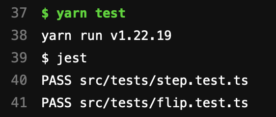
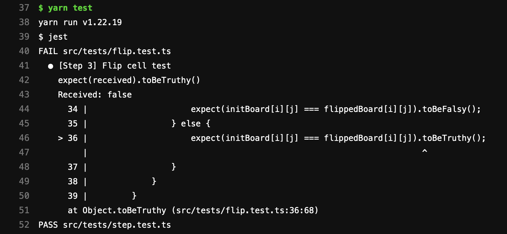

# 管理状态与处理事件

## 实验目的

通过本 Step，我们希望你能够掌握如何设定一个有状态的 React 组件以及如何通过回调函数处理各种事件，最终能够编写出一个能够通过点击棋盘切换细胞状态以及能够通过点击按钮推进演变的康威生命游戏。

## 实验步骤

首先，你需要理解 React 中状态的概念，并对类似按钮等组件的 `onClick` 类似属性有基本的认识。同时，能够理解回调函数在处理事件之中的作用。

之后，你需要在两处完成代码填空。

第一处在文件 `src/utils/logic.ts` 文件的 `flipCell` 函数中，你需要在注释 `// Step 3 BEGIN` 与 `// Step 3 END` 之间的部分填充你的代码以实现切换棋盘中某一个给定细胞的状态（存活变为死亡，死亡变为存活）的功能。本处填空的代码量在 20 行以内。

为了确认第一处代码填空正确完成，可以运行命令 `yarn test flip` 运行我们编写好的单元测试，如果显示下述提示信息则代表你完成了 Step 3 的第一处填空：


第二处在文件 `src/pages/index.tsx` 文件的 `BoardScreen` 组件中，你需要在注释 `// Step 3 & 4 BEGIN` 与 `// Step 3 & 4 END` 之间的部分填充你的代码，以正确调用先前编写好的 `flipCell` 函数完成点击事件的处理。本处填空的代码量在 5 行以内。

在完成填空后，目前的游戏应当具有下述功能：

- 点击棋盘上的某个细胞，能够切换其状态（存活变为死亡，死亡变为存活），并且棋盘能够实时反应这一变化（颜色能够跟随点击切换）
- 点击棋盘下方的按钮，能够推进一步演变

完成本 Step 后，你的游戏主界面的交互应当和下述 GIF 图所展示的类似：


### 代码说明

需要注意，我们在 `flipCell` 函数中留有下述两行代码：

```typescript
throw new Error("This line should be unreachable.");
return board;
```

这两行代码的作用是，在你填入你的代码前，该函数是没有返回值的，此时 ESLint 会认为该函数返回值类型不符合其声明而报错。为了在你填写代码前这里不触发 ESLint Error，我们加入了这两行代码。不过，在你填入你的代码之后，这两行代码应当不可到达。

其次，文件 `src/utils/logic.ts` 中我们已经写好了一个错误的 `badFlipCell` 函数，该函数是 `flipCell` 函数的一个错误实现，请思考该实现错误的原因。

## 实验评分

本 Step 总分为 15 分。

本 Step 采用自动与人工混合评分。人工评分占 10 分，自动评分占 5 分。

人工评分中我们会查看截止时间前最后一次部署后游戏主界面，进行如下操作并评分：

- （2 分）在初始条件下，任意点击若干个不同的细胞，这些细胞均应该变为存活状态，颜色也应该相应改变
- （3 分）连续点击某一个细胞，该细胞应该不断在存活与死亡状态之间切换，颜色也应该相应改变
- （5 分）设置某一种初始条件，不断点击棋盘下方按钮，上方棋盘应当正确展现演变情况

Step 3 的一部分与 Step 1 采用自动化评分。在正确完成 CI/CD 小作业的基础上，你应当能在 SECoder Gitlab CI 上观察到单元测试所输出的信息。如果完全通过，显示应当类似于：



如果仅通过 Step 1 与 Step 3 中的某一个，显示应当类似于：



只要上述信息中显示 Step 3 测试通过，本 Step 自动评分即满分。

若你未正确完成 CI/CD 小作业导致无法通过上述方式评分，我们会使用克隆仓库并本地运行单元测试等方式评分。

## 知识讲解

我们已经讲解了一个无状态的组件如何编写，一个无状态的组件实际上类似于**纯函数**，即无论在什么条件下调用该组件，只要传入的参数一样，那么最后总是得到一样的结果。然而仅仅使用无状态组件显然是无法完成能够处理用户交互的 UI 的。

React 是允许组件具有状态的，并且允许编写相应的代码让用户的点击等行为触发状态的改变。

首先，在一个组件内声明该组件的状态的方式是使用 `useState` Hook，如文件 `src/pages/index.tsx` 中组件 `BoardScreen` 中的下述代码：

```typescript
const [board, setBoard] = useState<Board>(props.init?.initBoard ?? getBlankBoard());
const [autoPlay, setAutoPlay] = useState<boolean>(false);
const [userName, setUserName] = useState<string>(props.init?.initUserName ?? "");
const [boardName, setBoardName] = useState<string>(props.init?.initBoardName ?? "");
```

以第二行为例，该语句表明我们声明了一个名为 `autoPlay` 的，类型布尔值的状态，其初始值是 `false`。这里 `setAutoPlay` 是一个函数，可以使用该函数修改 `autoPlay` 的值，而 React 框架会在该函数调用后，由于组件状态发生改变，触发对该组件的重新渲染。该函数的调用方式有两种，第一种是直接传入新状态值，而遇到后续状态依赖于先前状态的场景的时候，则使用第二种，传入回调函数：

```typescript
setAutoPlay(true); // 第一种，直接传值
setAutoPlay((o) => !o); // 第二种，回调函数，回调函数参数为先前状态，返回值为后续状态
```

这里需要强调两点。

第一点是，如果使用直接传值的方式调用，则可能面临值消失的问题。用于修改状态的函数如果采用第一种调用方式，其会把新状态放入一个队列，并且在合适的时机执行状态更新和重新渲染，这样的操作可能会导致状态更新事实上是**不及时的**。这种处理方式可以优化性能，但可能导致意料之外的结果，比如：

```typescript
const [cnt, setCnt] = useState<number>(1);

setCnt(cnt + 1);
setCnt(cnt + 1);
```

这里两次更新很近，很有可能导致运行到第二次更新的时候第一次更新还在等待队列内并未实际执行，也就导致生成第二次更新时 `cnt` 依然是 `1`，最后的结果是 `cnt` 仅仅加了 `1` 变为 `2`，而非期望中的 `3`。

该问题的解决方案是使用第二种调用方式，即传入回调函数。React 依然采用了队列的处理方式来优化性能，然而 React 这次会把回调函数放入队列，实际更新的时候会按照队列顺序依次执行这些回调，所以即使两次更新很近，但两个回调都会被执行，这就保证了符合预期的结果：

```typescript
const [cnt, setCnt] = useState<number>(1);

setCnt((cnt) => cnt + 1);
setCnt((cnt) => cnt + 1);
```

第二点是，如果更新后的状态与先前状态一致，则 React 会忽略本次更新导致的重新渲染。这里的“一致”，对于数字、字符串等基本类型指的是值相等，对对象等复杂类型指的是其引用指向同样的内存。React 框架这种为了性能而跳过重新渲染的机制可能会导致意料之外的结果。

为了处理用户的行为，如对某一个组件的点击行为，我们可以在类似 `<div />` 等的标签的 `onClick` 属性中定义一个回调函数，在这个函数中调用状态修改函数以更新组件状态：

```typescript
<div onClick={() => setCnt((cnt) => cnt + 1)}>
    You have clicked it for {cnt} times.
</div>
```
