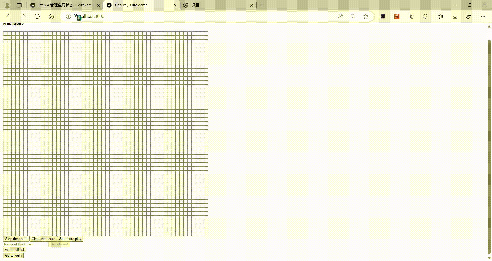

# 管理全局资源

## 实验目的

通过本 Step，我们希望你能够掌握如何在 React 的函数组件中管理一个全局资源对象，学会合理地分配与回收资源，并且通过合理分配计时器资源来实现康威生命游戏的自动演变。

## 实验步骤

首先你需要理解如何使用 React 之中的 `useRef` Hook，并且简单了解如何在 TypeScript 语言之中设定计时器和回收计时器。

之后，你需要在文件 `src/pages/index.tsx` 中的 `BoardScreen` 组件内完成三处代码填空。其中第一处与 Step 3 共用，你需要对先前填入的代码作一定的修改使得能够判定当前是否需要处理棋盘点击事件。第二处位于 `startAutoPlay` 函数中，你需要完成该函数以分配计时器资源并启动自动播放。第三处位于 `stopAutoPlay` 函数中，你需要完成该函数以回收计时器资源并停止自动播放。

本 Step 三处填空的代码量均在 5 行以内。

在完成填空后，目前的游戏应当支持自由状态和自动播放状态的切换，并且合理管理各种交互。

完成本 Step 后，你的游戏主界面的交互应当和下述 GIF 图所展示的类似：



### 代码说明

我们已经在 `BoardScreen` 组件内声明了 `timerRef` 引用，可以直接在此基础上完成你的代码。

创建一个周期计时器的方法为使用内置的 `setInterval` 函数，回收计时器则使用 `clearInterval` 函数。请自行使用搜索引擎查询这两个函数的使用方式完成本 Step。

## 实验评分

本 Step 总分为 5 分。

本 Step 采用人工评分。我们仅会**在通过 CI 检查的基础上**查看最后一次部署后游戏主界面是否满足：

- （2 分）在自由状态通过点击棋盘设置好某一起始状态后点击 Start auto play 按钮能够进入自动播放状态，棋盘每次自动演变的间隔需要在 1 秒内
- （2 分）在自动播放状态下，点击棋盘，其不应当响应点击事件
- （1 分）在自动播放状态下，点击 Stop auto play 按钮能够退回自由状态，自动演变停止，点击棋盘，其响应点击事件

## 知识讲解

当我们需要管理一个全局资源的时候，比如说这个资源并不会因为组件重新渲染而需要重新设置等等，这个时候我们显然不能使用先前提到的 `useState` 管理这类对象，此时可以尝试使用 `useRef` Hook。

`useRef` 的基本使用场景是管理一个独立于组件的全局资源，如一个控制组件演变的计时器。其创建方式为：

```typescript
const ref = useRef(/* Init value */);
```

上述语句会创建开辟一片内存用于管理全局资源，并令引用 `ref` 指向这一片内存。我们可以方便地利用 `current` 属性（即使用 `ref.current` 表达式）访问到其指向的全局资源，以读取或者管理全局资源。另外，我们也可以方便地使用赋值语句来重新设置全局资源：

```typescript
ref.current = /* A new value */;
```

需要注意的是，对 `ref.current` 的任何修改都不会触发组件的重新渲染。

`useRef` 还有一种用途是用于管理庞大的状态。比如说某个页面需要显示新闻列表，那么新闻列表将会是一个相当庞大的状态，若使用 `useState`，则可能造成较大的性能压力。那么，将新闻列表作为全局资源管理在组件外，使用 `ref.current` 的方式访问该新闻列表是一种可行的方案。而为了让修改新闻列表时触发组件重新渲染，可以使用 `useState` 将最近一次新闻列表更新时间戳作为组件状态进行管理，每次新闻列表更新则修改时间戳以触发重新渲染。