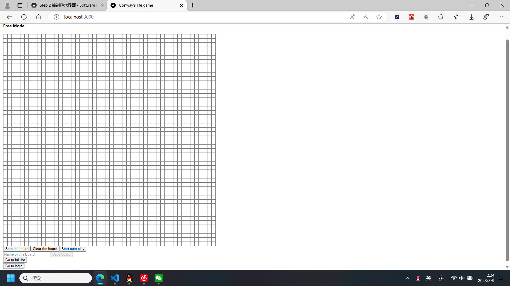

# 绘制游戏界面

## 实验目标

通过本 Step，我们希望你能够掌握 React 框架的基本使用，学会使用属性传递参数并且编写完成康威生命游戏的界面。

## 实验步骤

首先，你需要理解 React 中组件的概念，并理解如何使用属性来控制组件的显示方式。

之后，你需要在 `src/BoardScreen.tsx` 文件的组件 `BoardUI` 之中，**两处**注释 `// Step 2 BEGIN` 与 `// Step 2 END` 之间的部分填充你的代码（有一处和 Step 3 共用），使得屏幕上能够出现一个 $50 \times 50$ 的灰色边框棋盘，棋盘中细胞的背景色可以任意指定，我们建议为白色。注意，请勿改动其余部分的代码，请勿新建文件、删除文件。

完成本 Step 后，参考的界面如下：

【TODO：由于 Step 3 加了个按钮，这里示意图需要改】

### 实验提示

- 标签 `
` 的 `style` 属性中 `flexDirection` 字段决定了所有子元素按照何种方式排列。

### 代码说明

`src/BoardScreen.tsx` 文件中包含下述组件：

- `Square`。绘制一个长宽均为 `16`，边框为宽为 `1` 的灰色实线的正方形，其背景色由属性指定
- `BoardUI`。游戏中棋盘的 UI，由 $50 \times 50$ 个正方形格子组成
- `BoardScreen`。代表整个游戏区域

## 实验评分

本 Step 总分为 5 分。

本 Step 采用人工评分。由于该界面的细节可能会在后续的 Step 中修改，我们仅会**在通过 CI 检查的基础上**查看最后一次部署后游戏主界面是否满足：

- 存在一个 $50 \times 50$ 的棋盘
- 该棋盘具有灰色实线边框

上述两个条件均满足，则你获得本 Step 所有分数。否则，如果任何一个条件不满足，则你本 Step 评为零分。

## 知识讲解

【TODO】